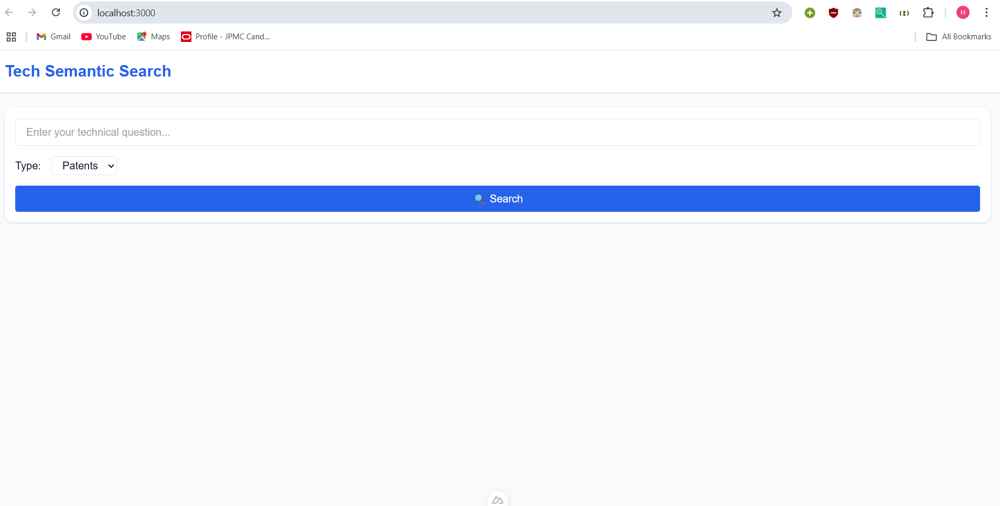
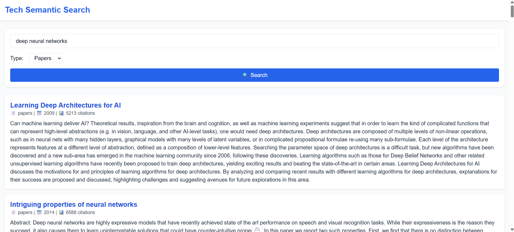
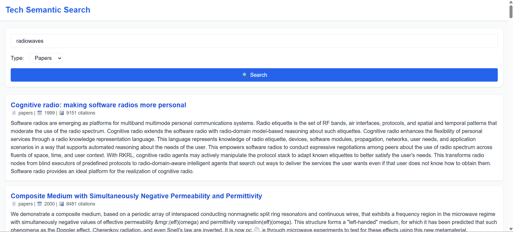

# 🔍 Semantic Search System for Technical Documents

This project is a **semantic search engine** designed for technical researchers to query and retrieve relevant **patents** and **research papers** using **natural language**. It supports document type filtering, relevance scoring, and displays metadata-rich results.

## 🚀 Features

- 🔎 Natural language search query input
- 📚 Search across both patent and research paper datasets
- 🧠 Embedding generation using Sentence Transformers
- ⚡ Fast vector similarity search with Milvus
- 🌐 REST API built with FastAPI
- 💻 Frontend built using NuxtJS & Tailwind CSS
- 🎨 Clean UI with metadata-rich result cards

---

## 🧰 Technology Stack

| Layer        | Technology             |
|--------------|------------------------|
| Backend      | Python + FastAPI       |
| Embeddings   | Sentence Transformers  |
| Vector Store | Milvus (via Docker)    |
| Frontend     | NuxtJS (Vue 3)         |
| Styling      | Tailwind CSS           |

---

## 📂 Project Structure

```
search-assignment/
├── backend/
│   ├── main.py
│   ├── search_engine.py
│   ├── milvus_client.py
│   └── embedder.py
├── frontend/
│   ├── pages/
│   │   └── index.vue
│   ├── components/
│   │   ├── SearchBar.vue
│   │   └── ResultCard.vue
│   └── utils/api.js
├── data/
│   ├── patents_sample.csv
│   └── papers_sample.csv
└── docker-compose.yml
```

---

## 🧪 How it Works

1. User enters a technical query in the frontend.
2. The query is embedded using Sentence Transformers.
3. Milvus returns the top 50 semantically similar documents.
4. Results are shown on the frontend with title, abstract, year, citations, and type.

---

## ⚙️ Setup Instructions

### Prerequisites

- Docker & Docker Compose
- Node.js 
- Python 3.9+ and `venv`

### 1. Clone the Repository

```bash
git clone https://github.com/hardik-47/search-system.git
cd search-system
```

### 2. Start Milvus (Vector DB)

```bash
docker-compose up -d
```

### 3. Setup Backend

```bash
cd backend
python -m venv venv
venv\Scripts\activate  # Windows
pip install -r requirements.txt
python main.py
```

### 4. Setup Frontend

```bash
cd frontend
npm install
npm run dev
```

Access frontend at: `http://localhost:3000`  
Backend runs at: `http://localhost:8000`

---

## 📸 Screenshots






---

## 📄 License

MIT License © 2025 Hardik Jain
